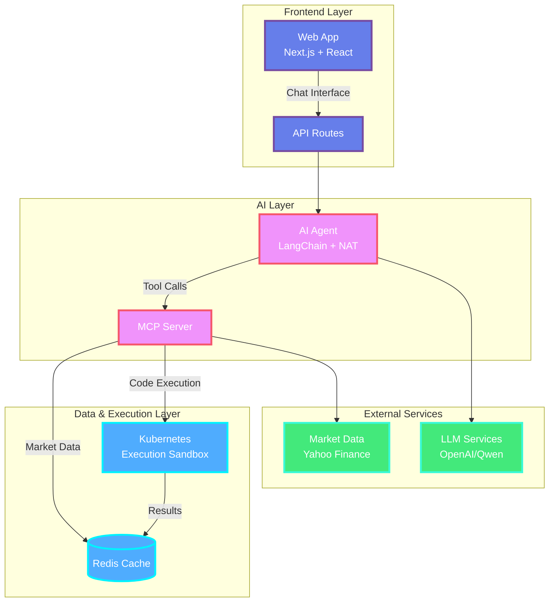
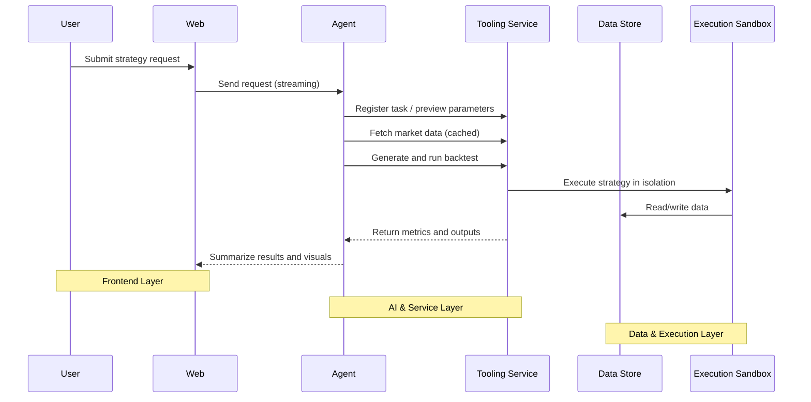

# 🚀 AgentQuant

<div align="center">

**AI-Powered Quantitative Trading Platform**

_Transform natural language into sophisticated trading strategies with real-time backtesting and interactive visualization_

[](https://nlpquant.ai/)

[](https://www.gnu.org/licenses/agpl-3.0)
[](https://nodejs.org/)
[](https://python.org/)
[](https://nextjs.org/)
[](https://www.typescriptlang.org/)

</div>

---

## 🎯 Overview

AgentQuant is a cutting-edge **AI-assisted quantitative trading platform** that revolutionizes how traders and developers approach strategy development. By combining advanced language models with sophisticated tooling infrastructure, it transforms natural language trading ideas into executable, backtestable strategies with comprehensive performance analytics.

<div align="center">
  
  <p><em>See AgentQuant in action - from natural language to trading results in seconds!</em></p>
</div>

> 🚀 **Ready to try AgentQuant?** [Join our waitlist](https://nlpquant.ai/) for early access to the platform!

### ✨ Key Features

- 🤖 **AI-Powered Strategy Generation**: Convert natural language into sophisticated trading logic
- 📊 **Real-Time Market Data**: Live data feeds with intelligent caching and preprocessing
- 🔬 **Advanced Backtesting**: Isolated execution environments with comprehensive metrics
- 📈 **Interactive Visualization**: Beautiful charts, KPIs, and trade analysis
- 🔄 **Streaming Progress**: Real-time feedback during strategy development
- 🛠️ **Extensible Architecture**: Modular design with pluggable components
- 🚀 **Production Ready**: Docker-based deployment with Kubernetes support

---

## 🏗️ Architecture

### System Components



### Technology Stack

| Component           | Technology                         | Purpose                                            |
| ------------------- | ---------------------------------- | -------------------------------------------------- |
| **Frontend**        | Next.js 15, React 19, TypeScript   | Modern web interface with streaming UI             |
| **AI Agent**        | LangChain, NVIDIA NAT, Python 3.12 | Natural language processing and tool orchestration |
| **Tooling Service** | FastAPI, MCP Protocol              | Unified API for market data and execution          |
| **Execution**       | Kubernetes, Docker                 | Isolated backtesting environments                  |
| **Data Store**      | Redis 7                            | High-performance caching and state management      |
| **Charts**          | Lightweight Charts, Recharts       | Professional financial visualizations              |
| **Styling**         | Tailwind CSS, Radix UI             | Modern, accessible design system                   |

### End-to-End Sequence (Simplified)



---

## 🚀 Quick Start

### 📋 Prerequisites

| Requirement      | Version | Notes                             |
| ---------------- | ------- | --------------------------------- |
| **Node.js**      | 18+     | With `pnpm` package manager       |
| **Python**       | 3.12+   | With `uv` package manager         |
| **Docker**       | Latest  | & `Docker Compose`                |
| **Kubernetes**   | Latest  | For code execution sandbox        |
| **Redis**        | 7+      | _(Included in Docker setup)_      |
| **LLM API Keys** | -       | For both generic and coder models |

### Option 1: Docker Compose (Recommended)

```bash
# Clone the repository
git clone https://github.com/nlpquant/AgentQuant.git
cd AgentQuant

# Set up environment variables
cd deploy
export LLM_GENERIC_MODEL_NAME='qwen3-plus'
export LLM_CODER_MODEL_NAME='qwen3-coder-plus'
export LLM_GENERIC_MODEL_API_ENDPOINT='your-api-endpoint'
export LLM_CODER_MODEL_API_ENDPOINT='your-api-endpoint'
export LLM_GENERIC_MODEL_API_KEY='your-api-key'
export LLM_CODER_MODEL_API_KEY='your-api-key'

# Start all services
docker-compose up -d

# Check service health
docker-compose ps
```

### Option 2: Local Development

```bash
# Install dependencies
pnpm install

# Start Redis
docker run --rm -p 6379:6379 redis:7-alpine

# Start Kubernetes cluster (required for code execution)
cd deploy
docker-compose up kind -d
# Wait for cluster to be ready
docker-compose exec kind sh -c "kubectl wait --for=condition=Ready nodes --all --timeout=300s"
# Verify cluster is running
docker-compose exec kind sh -c "kubectl get nodes"

# Start Tooling Service (in new terminal)
cd apps/mcp-server
uv venv --python 3.12 --seed .venv
source .venv/bin/activate
uv sync
uv run uvicorn mcp_server.main:api --reload --port 8080

# Start AI Agent (in new terminal)
cd apps/agent
uv venv --python 3.12 --seed .venv
source .venv/bin/activate
uv sync
export LLM_GENERIC_MODEL_API_KEY='your-api-key-here'
export LLM_CODER_MODEL_API_KEY='your-api-key-here'
uv run nat serve --config_file configs/config.yaml

# Start Web App (in new terminal)
cd apps/web
pnpm dev
```

### 🌐 Access Points

| Service             | URL                        | Description                         |
| ------------------- | -------------------------- | ----------------------------------- |
| **Web Application** | http://localhost:3000      | Main user interface                 |
| **Agent API**       | http://localhost:8000/docs | AI Agent API documentation          |
| **Tooling Service** | http://localhost:8080/docs | MCP Server API documentation        |
| **Redis Insight**   | http://localhost:5540      | Database visualization _(dev only)_ |
| **MCP Inspector**   | http://localhost:6274      | Tool debugging _(dev only)_         |

---

## 🎮 Usage Examples

### ✅ Basic Strategy Request

```text
"Create a moving average crossover strategy for AAPL with 20-day and 50-day periods,
backtest it for the last 2 years, and show me the performance metrics"
```

### 🚧 Advanced Technical Analysis _(In Roadmap)_

```text
"Build an RSI mean reversion strategy for SPY with:
- RSI oversold at 30, overbought at 70
- Bollinger Bands for entry confirmation
- 2% stop loss, 4% take profit
- Backtest on 5-minute data for the last 3 months"
```

### 🚧 Multi-Asset Strategy _(In Roadmap)_

```text
"Create a pairs trading strategy between INTC and AMD using:
- 60-day rolling correlation
- Z-score entry/exit signals
- Risk management with position sizing
- Show me the equity curve and drawdown analysis"
```

---

## 📊 Features Deep Dive

### 🤖 AI Agent Capabilities

- **Natural Language Understanding**: Interprets complex trading requirements
- **Multi-Step Planning**: Breaks down complex strategies into executable steps
- **Tool Orchestration**: Seamlessly coordinates data fetching, analysis, and execution
- **Streaming Feedback**: Real-time progress updates during strategy development
- **Error Recovery**: Intelligent handling of failures with retry mechanisms

### 📈 Market Data & Analysis

- **Real-Time Data**: Live market feeds via Yahoo Finance API
- **Historical Data**: Comprehensive historical datasets with multiple timeframes
- **Technical Indicators**: 50+ built-in indicators (RSI, MACD, Bollinger Bands, etc.)
- **Data Caching**: Intelligent Redis-based caching for performance
- **Data Validation**: Automatic data quality checks and preprocessing

### 🔬 Backtesting Engine

- **Isolated Execution**: Secure, sandboxed code execution environments
- **Multiple Timeframes**: Support for tick, minute, hourly, daily data
- **Realistic Simulation**: Slippage, commissions, and market impact modeling
- **Performance Metrics**: 20+ comprehensive performance indicators
- **Risk Analysis**: Drawdown, Sharpe ratio, maximum adverse excursion

### 📊 Visualization & Analytics

- **Interactive Charts**: Professional candlestick charts with technical overlays
- **Performance Dashboards**: Real-time KPI monitoring and analysis
- **Trade Analysis**: Detailed trade-by-trade breakdown with entry/exit points
- **Signal Visualization**: Clear buy/sell signal overlays on price charts
- **Export Capabilities**: PDF reports and CSV data export

---

## 🛠️ Development

### Project Structure

```
AgentQuant/
├── apps/
│   ├── web/                 # Next.js frontend application
│   ├── agent/               # AI agent service (Python)
│   └── mcp-server/          # Tooling service (FastAPI)
├── deploy/                  # Docker and Kubernetes configurations
├── components/              # Shared UI components
└── types/                   # TypeScript type definitions
```

### 🛠️ Available Scripts

#### Monorepo Commands

```bash
pnpm build          # Build all applications
pnpm dev            # Start all services in development mode
pnpm lint           # Run linting across all packages
pnpm format         # Format code with Prettier
pnpm test           # Run test suites
```

#### Individual Service Commands

```bash
# Web Application
cd apps/web && pnpm dev

# Tooling Service
cd apps/mcp-server && uv run uvicorn mcp_server.main:api --reload --port 8080

# AI Agent
cd apps/agent && uv run nat serve --config_file configs/config.yaml
```

### 🔧 Adding New Features

| Feature Type             | Location                      | Description                |
| ------------------------ | ----------------------------- | -------------------------- |
| **Technical Indicators** | `apps/mcp-server/mcp_server/` | Add new trading indicators |
| **UI Components**        | `apps/web/components/`        | Create React components    |
| **Agent Tools**          | `apps/agent/src/agent/`       | Extend AI capabilities     |
| **API Endpoints**        | `apps/mcp-server/mcp_server/` | Add new API routes         |

---

## 🚀 Deployment

### Production Deployment

The platform supports multiple deployment strategies:

#### Docker Compose (Single Server)

```bash
cd deploy
docker-compose -f docker-compose.prod.yml up -d
```

#### Kubernetes (Scalable)

```bash
kubectl apply -f deploy/k8s/
```

#### Production Environments

| Environment    | Use Case              | Description                                  |
| -------------- | --------------------- | -------------------------------------------- |
| **Local**      | Development & Testing | Docker Compose for local development         |
| **Kubernetes** | Production            | Scalable deployment for production workloads |

### Environment Configuration

| Variable                         | Description                    | Required |
| -------------------------------- | ------------------------------ | -------- |
| `LLM_GENERIC_MODEL_NAME`         | Model name for general tasks   | ✅       |
| `LLM_CODER_MODEL_NAME`           | Model name for code generation | ✅       |
| `LLM_GENERIC_MODEL_API_ENDPOINT` | API endpoint for generic model | ✅       |
| `LLM_CODER_MODEL_API_ENDPOINT`   | API endpoint for coder model   | ✅       |
| `LLM_GENERIC_MODEL_API_KEY`      | API key for generic model      | ✅       |
| `LLM_CODER_MODEL_API_KEY`        | API key for coder model        | ✅       |
| `REDIS_URL`                      | Redis connection string        | ✅       |
| `K8S_CONFIG_FILE`                | Kubernetes config path         | Optional |

---

## 📚 API Reference

### Core Endpoints

| Endpoint                 | Method | Description              |
| ------------------------ | ------ | ------------------------ |
| `/api/chat`              | POST   | Submit strategy requests |
| `/api/data/[storageKey]` | GET    | Retrieve market data     |
| `/api/result/[taskId]`   | GET    | Get backtest results     |
| `/health`                | GET    | Service health check     |

### MCP Tools

| Tool            | Description                 |
| --------------- | --------------------------- |
| `quick_preview` | Preview strategy parameters |
| `yh_query_save` | Fetch and cache market data |
| `code_executor` | Execute backtest code       |
| `task_manager`  | Manage strategy tasks       |

---

## 🤝 Contributing

We welcome contributions! Please see our [Contributing Guidelines](CONTRIBUTING.md) for details.

### Development Setup

1. Fork the repository
2. Create a feature branch: `git checkout -b feature/amazing-feature`
3. Make your changes and add tests
4. Run the test suite: `pnpm test`
5. Commit your changes: `git commit -m 'Add amazing feature'`
6. Push to the branch: `git push origin feature/amazing-feature`
7. Open a Pull Request

---

## 📄 License

This project is licensed under the GNU Affero General Public License v3.0 (AGPL-3.0) - see the [LICENSE](LICENSE) file for details.

---

## 🙏 Acknowledgments

- **LangChain** for AI orchestration framework
- **NVIDIA NAT** for agent infrastructure
- **FastAPI** for high-performance API framework
- **Next.js** for modern React framework
- **Lightweight Charts** for financial visualizations
- **Redis** for high-performance caching

---

## 📞 Support

- 🌐 **Official Website**: [nlpquant.ai](https://nlpquant.ai/) - Join our waitlist for early access
- 📖 **Documentation**: [Wiki](https://github.com/nlpquant/AgentQuant/wiki)
- 🐛 **Bug Reports**: [Issues](https://github.com/nlpquant/AgentQuant/issues)
- 💬 **Discussions**: [GitHub Discussions](https://github.com/nlpquant/AgentQuant/discussions)
- 📧 **Email**: support@agentquant.com

---

<div align="center">

**Built with ❤️ by the AgentQuant Team**

[Website](https://nlpquant.ai/) • [GitHub](https://github.com/nlpquant/AgentQuant) • [Documentation](https://github.com/nlpquant/AgentQuant/wiki)

</div>
